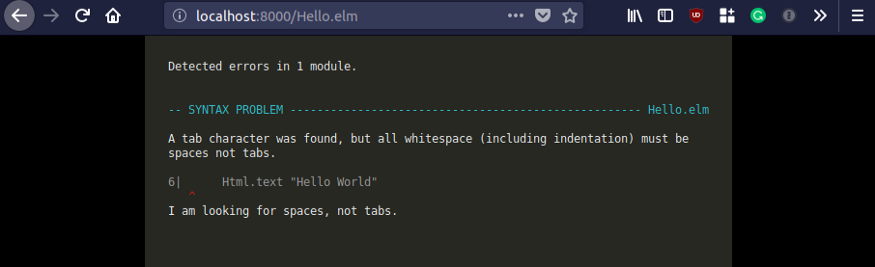

# 一文解决现代编程语言选择困难（第二部分：响应式编程）

---

**摘要：** 如何了解某种编程语言的优缺点？如果搜索“最佳编程语言”，结果会罗列一堆文章，涵盖各主流语言，并且大多对各语言优缺点的表述模棱两可，表述不到位，缺少实战借鉴意义。本文概述了当前广为使用乃至可能小众的现代编程语言，按推荐程度从低到高依次列出。希望本文有助于选择合适的工具完成工作，降低开发工作量。原文篇幅过长。译文按设计用于命令式编程的C语言家族，以及设计用于响应式编程的ML语言家族，分为上下两篇提供。本文是下篇。

**作者：**  [Ilya Suzdalnitski](https://suzdalnitski.medium.com/)

**正文：** 

## 函数式编程


照片来自[Unsplash](https://unsplash.com/s/photos/tool?utm_source=unsplash&utm_medium=referral&utm_content=creditCopyText)照片共享网站的[Ante Hamersmit](https://unsplash.com/@ante_kante?utm_source=unsplash&utm_medium=referral&utm_content=creditCopyText)。

开篇先介绍函数式编程，然后继续对语言做排名。为什么要考虑函数式编程？因为函数式编程令开发者从善如流。

函数式编程可能听起来有些高大上，但实际上无需过于担心。简而言之，函数式语言吸取了其他一些语言的经验教训，实现了许多正确的设计决策。在很多情况下，函数式语言提供正确的功能，包括具有ADT支持的强大类型系统、无空值、无需异常的错误处理、对不可变数据结构的内建支持、模式匹配和函数compose运算符。

那么做为本文评判的加分项，函数式编程语言提供哪些共性的优势？

### 使用纯函数的编程

不同于主流的命令式语言，函数式编程语言鼓励使用纯函数（pure function）编程。

什么是纯函数？该理念非常简单，即给定相同的输入，将始终返回相同的输出。例如，2+2始终返回4，因此加法运算符“+”是纯函数。

纯函数不允许与外界交互，不支持API调用，无法写入控制台，甚至不允许更改状态。这完全不同于面向对象编程所采取的方法，即其中任何方法都可以自由地变更（Mutating）其他对象的状态。

纯函数和非纯函数非常易于区分。函数是否不带参数，是否不返回值？如是，则为非纯函数。

下面给出一个非纯函数的例子：

```
// 非纯函数，根据随后的调用，返回不同的值。
// 要点：不带任何参数。
Math.random(); // => 0.5456412841544522
Math.random(); // => 0.7542151348966241
Math.random(); // => 0.4534865342354886

let result;
// 非纯函数，变更外部状态，即result变量。
// 要点：不返回任何值。
function append(array, item) {
  result = [ ...array, item ];
}
```

下面给出几个纯函数的例子：

```
// 纯函数：不变更函数体外任何状态。
function append(array, item) {
  return [ ...array, item ];
}

// 纯函数：同样的输入，总是返回相同的输出。
function square(x) { return x * x; }
```

此类方法看上去难以理解，需要一段时间才能习惯。我一开始也对此颇感困惑！

那么纯函数有什么好处？它非常容易测试，无需Mock和Stub。易于推断，不同于面向对象编程，无需牢记整个应用的状态。开发人员只需关注当前正在操作的函数。

纯函数可以轻松复合（compose）。由于纯函数之间不存在共享状态，因此非常易于实现并发。纯函数的重构可谓是件快事，只需复制和粘贴，完全可不借助于任何复杂的IDE工具。

简而言之，纯函数让编程回归欢乐。

函数式编程鼓励使用纯函数。如果90％以上的代码库是由纯函数组成时，这当然很好。但是一些语言也走了极端，完全禁止使用非纯函数，这并非总是好事。

### 不可变数据解雇


本文下面列出所有函数式语言，均内建支持不可变数据结构。不可变数据结构也是持久的，一旦更改，不必创建整个数据结构的深层拷贝。设想一下如果反复地对一个超10万项元素的数组做镜像拷贝，那么性能一定好不了。

持久数据结构无需创建拷贝，只需在简单重用旧数据结构引用的同时，添加所需的更改即可。


### 代数数据类型（ADT）


ADT是一种强大的应用状态建模方法，类似于采用合成类固醇的方法构建枚举类型（Enums on steroids）。我们只需指定构成某个类型的可能“子类型”，以及子类型的构造函数参数。例如：

```
type shape = 
   | Square(int)
   | Rectangle(int, int)
   | Circle(int);
```

上例中，“shape”类型可以是Square,、Rectangle或Circle。 Square的构造函数使用单个int参数，即指定正方形的宽度；Rectangle使用两个int参数，即指定长方形的宽度和高度；而Circle使用单个int参数，即圆的半径。

下面给出类似功能的Java实现代码：

```
interface Shape {}

public class Square implements Shape {
  private int width;

  public int getWidth() {
    return width;
  }

  public void setWidth(int width) {
    this.width = width;
  }
}

public class Rectangle implements Shape {
  private int width;
  private int height;

  public int getWidth() {
    return width;
  }

  public void setWidth(int width) {
    this.width = width;
  }
  
  public int getHeight() {
    return height;
  }

  public void setHeight(int height) {
    this.height = height;
  }
}


public class Circle implements Shape {
  private int radius;

  public int getRadius() {
    return radius;
  }

  public void setRadius(int radius) {
    this.radius = radius;
  }
}
```

相比之下，谁又会抗拒使用函数式语言的ADT？

### 模式匹配


所有函数式语言都提供对模式匹配的极大支持。模式匹配通常用于编写更具表现力的代码。

下面给出一个布尔选项类型的模式匹配例子：

```
type optionBool =
   | Some(bool)
   | None;

let optionBoolToBool = (opt: optionBool) => {
  switch (opt) {
  | None => false
  | Some(true) => true
  | Some(false) => false
  }
};
```

下面给出未使用模式匹配的相同功能代码：


```
let optionBoolToBool = opt => {
  if (opt == None) {
    false
  } else if (opt === Some(true)) {
    true
  } else {
    false
  }
}
```

毫无疑问，使用模式匹配的代码更具表现力，更为简洁。

模式匹配还确保提供编译时的详尽信息，以免开发人员忘记检查各种可能情况。非函数式语言没有提供此类保证。


### 空值


空值引用通常在函数式编程语言中是避免使用的。和Rust一样，使用Option模式替代。例如：

```
let happyBirthday = (user: option(string)) => {
  switch (user) {
  | Some(person) => "Happy birthday " ++ person.name
  | None => "Please login first"
  };
};
```

### 错误处理


异常通常并不建议在函数式语言中使用。同样类似于Rust，使用的是Result模式。例如：

```
type result('value, 'error) =
  | Ok('value)
  | Error('error);

let happyBirthday = (user: result(person, string)) => {
  switch (user) {
  | Ok(person) => "Happy birthday " ++ person.name
  | Error(error) => "An error occured: " ++ error
  };
};
```

对于函数式错误处理，在“[Composable Error Handling in OCaml](https://keleshev.com/composable-error-handling-in-ocaml)”一文中给出了很好的说明。

### Pipe forward操作符


如果没有pipe forward运算符，函数调用难免存在嵌套，进而降低了代码的可读性。例如：

```
let isValid = validateAge(getAge(parseData(person)));
```

函数式语言特别提供了管道运算符，简化了编程。上面代码可重写为：

```
let isValid =
  person
    |> parseData
    |> getAge
    |> validateAge;
```

## Haskell


Haskell完全可称为所有函数式编程语言的“鼻祖”。Haskell已30多岁了，甚至比Java还要老。函数式编程中的许多最佳创意，都源于Haskell。

语言家族：ML.

👍 👍 类型系统

Haskell具有比其他任何语言更强大的类型系统。当然，Haskell支持ADT，也支持类型类（Typeclass）。其类型检查器几乎可完成所有推断。

👎👎 学习难度

非常难！众所周知，有效地使用Haskell，首先必须精通范畴学，这并非开玩笑。面向对象编程需要多年的经验才能写出良好的代码，而学习Haskell则需要投入大量的精力，才能富有成效。

即便是使用Haskell编写一个简单的“Hello world”程序，也需要了解Monads，尤其是IO Monads。

👎👎 Community

> 根据我自身的经验，Haskell社区更具学术性。例如在Haskell软件库邮件列表中，一个最新帖子的开头是这样说的：

>“私人通讯指出，元组函数\x->(x,x)实际上是对biapplicative及其相关结构做单调（monadicially）对角化的一种特殊情况。”

>该帖子讨论热烈，得到39个答复。

> — [Hacker News](https://news.ycombinator.com/item?id=24978238)上用户momentoftop的发言。

上面所引用的内容，很好地评价了Haskell社区。Haskell社区更喜欢包括范畴论在内的学术讨论，而非解决实际问题。

👎 函数纯度

上文介绍过，纯函数优点多多，但存在一些副作用。例如，与函数体外的互动，包括变更状态（mutating state）。这些副作用是导致程序出现大量错误的重要原因。作为纯函数式语言，Haskell完全禁止使用这些副作用。这意味着函数永远不能变更任何值，甚至不允许与函数体外进行任何交互。从技术上来讲，甚至不允许记录日志等的操作。

当然，Haskell也提供了与外界交互的解决方法。其运作机制是通过提供一组称为IO Monad的指令。此类指令可提出：“读取键盘输入，然后在某些函数中使用该输入，然后将结果打印到控制台。” 之后，语言运行时会接受此类指令并执行。开发人员永远不会执行直接与外界交互的代码。

> 不惜一切代价避免成功！

> — Haskell的非官方座右铭.

事实上，对函数纯度的关注，显著地增加了抽象的数量，进而增加了复杂性，降低了开发人员的生产效率。

👍 空值

和Rust类似，Haskell不支持空引用。Haskell使用Option模式声明可能不存在的值。

👍 错误处理

尽管一些函数可能会抛出错误，Haskell代码的惯用模式类似于Rust中Result类型。

👍 不可变性

Haskell对不可变数据结构提供一等支持。

👍 模式匹配

Haskell提供很好的模式匹配支持。

👎 生态系统

Haskell的标准库完全不成体系，尤其是默认的核心软件库Prelude。Haskell默认使用抛出异常的函数，而不是采用函数编程标准做法的返回选项值。更糟的是，Haskell具有两个包管理器，Cabal和Stack。

### 评判


> 硬核（hardcore）函数式编程需要深度理解过多高度抽象的概念，因此永远不会成为主流。
> 
> — David Bryant Copeland，《软件设计的四项良好原则（Four Better Rules for Software Design）》

我的确非常欣赏Haskell，但不幸的是，Haskell可能永远局限于学术界。Haskell是最糟糕的函数式编程语言吗？各位自行判定，但我认为是。


## OCaml


OCaml是一种函数式编程语言。OCaml是“Object [Caml](https://en.wikipedia.org/wiki/Caml)”的缩写，但讽刺的是，[很少有人在OCaml中使用对象](https://stackoverflow.com/questions/10779283/when-should-objects-be-used-in-ocaml)。

OCaml的历史几乎和Java一样长，“O”很可能是来自于那个年代“对象”这一潮流。OCaml只是填补了[Caml](https://en.wikipedia.org/wiki/Caml)的空白。

语言家族：ML。


👍 👍 类型系统

OCaml的类型系统可与Haskell相媲美。最大的缺点是缺少类型类（Typeclass），但支持高阶模块函子（functor）。

OCaml是静态类型的。具有近乎Haskell的完美类型推断。


👎👎 生态系统

OCaml的社区并不大。这意味着开发人员无法针对一些通常用例找到高质量的软件库。例如，OCaml缺少适用的Web框架。

相比其他语言，OCaml软件库的文档质量堪忧。


👎 工具

OCaml的工具颇为混乱，并存在三种软件包管理器：Ppam、Dune和Esy。

OCaml编译器错误信息非常不友好。虽然这并非致命因素，但的确令人沮丧，会影响开发人员的生产率。


👎 学习资源

上手学习OCaml，推荐“[Real World OCaml](https://www.amazon.com/Real-World-OCaml-Functional-programming/dp/144932391X)”一书。但该书自2013年后就再未更新，其中得许多例子已经不合时宜。该书中得操作已不适用于现代工具。

相比其他语言，OCaml得教程可以说质量堪忧。大多只是学校课程的讲稿。

👎 并发

“多核随处可见（Multicore is coming Any Day Now™️）”这一口号，是OCaml并发历程的很好总结。OCaml开发者多年来一直在苦苦等待适用的多核支持，但看来近期也不会添加到该语言中。OCaml应该是唯一缺少良好多核支持的函数式语言。


👍 空值

OCaml不支持空引用，使用Option模式声明可能不存在的值。

👍 错误处理

OCaml代码惯用`Result`类型模式。


👍 不可变性

OCaml对不可变数据结构提供一等支持。

👍 模式匹配

OCaml提供很好的模式匹配支持。


### 评判


OCaml是一种很好的函数式语言，主要缺点是对并发支持不好，社区不大，因此生态系统过小，缺少学习资源。

考虑到上述不足，我并不推荐在生产环境中使用OCaml。

* 扩展阅读：“[远离OCaml](https://blog.darklang.com/leaving-ocaml/)”一文。

## Scala


Scala是为数不多真正的多重编程范式语言（Multi-paradigm programming language）。Scala同时很好地支持面向对象编程和函数式编程。

语言家族：C


👍 生态系统

Scala运行在JVM之上，因此可以访问Java软件库巨大的生态系统。这极大地提高了开发人员后台的生产效率。


👍 类型系统

Scala可能是唯一类型系统不健全（unsound）的有类型函数式编程语言，同时也缺少适当的类型推断。Scala的类型系统比不上其他函数式语言。

好的一面，Scala支持高级类类型（ Higher-Kinded Types）和类型类（类型类（Typeclass））。

尽管存在不足，Scala的类型系统依然值得肯定。


👎 代码简洁性和可读性

相比Java，Scala代码非常简洁，但可读性一般。

Scala是为数不多属于C语言家族的函数式编程语言。C语言家族设计为命令式编程，而ML家族语言设计为函数式编程。因此，使用Scala的类C语法进行函数式编程，时常看起来有些奇怪。

Scala中没有适当的ADT语法，对代码的可读性产生了不利的影响：

```
sealed abstract class Shape extends Product with Serializable

object Shape {
  final case class Square(size: Int) extends Shape
  final case class Rectangle(width: Int, height: Int) extends Shape
  final case class Circle(radius: Int) extends Shape
}
```

而使用ReasonML的ADT编写为：

```
type shape = 
   | Square(int)
   | Rectangle(int, int)
   | Circle(int);
```

在可读性上，ML家族语言的ADT明显胜出。


👎 👎 速度

Scala可能是本文所列出语言中编译速度最慢的。一个简单的Hello World程序，如果不使用最新的硬件，编译可能需要10秒。Scala编译不是并发的，使用单线程，编译速度不佳。

Scala运行在JVM上，这意味着程序启动所需时间更长。


👎 学习难度

Scala具有很多特性，导致学习难度高。该语言中充斥着各种特性。

Scala可能是第二难学的函数式语言，仅好于Haskell。事实上，很多企业放弃Scala的原因之一就是非常难学。

👍 不可变性

Scala使用案例类（Case Class），对不可变数据结构提供一流支持。

👌 空值

不好的一面，Scala支持空值。好的一面，Option模式是潜在缺失值的惯用方式。


👍 错误处理

和其他函数式语言一样，Result模式是Scala的惯用错误处理方式。

👌 并发

Scala运行在JVM上，并非完全设计用于并发。好的一面，其[Akka](https://en.wikipedia.org/wiki/Akka_(toolkit))工具集非常成熟，JVM提供类似Erlang的并发。


👍 模式匹配

Scala提供很好的模式匹配支持。


### 评判


我想要去喜欢Scala，但确实做不到。Scala想要做太多的事情，为了同时支持面向对象编程和函数式编程，其设计者不得不做出权衡。正如俄罗斯谚语所说：“追逐两个兔子的人，最终一无所获”。


## Elm


Elm是一种编译为JavaScript的函数式语言，主要用于前端Web开发。

承诺不会出现运行时异常，是Elm的独到之处。Elm编写的应用非常稳定。

语言家族：ML

👍 很好的错误信息

我看到最到位的错误信息，就是由Elm编译器提供的一些错误信息。这使得该语言即便是对完全小白也非常友好。


👍 错误处理

误Elm是纯函数式语言，没有运行时错误，也不支持异常。这意味着如果一个代码库是100%由Elm实现的，那么就永远不会出现运行时错误。Elm可能出现运行时错误的唯一情况，是与外部JavaScript代码交互时。

Elm是如何处理错误的？和其他函数式语言一样，使用`Result`数据类型。

👎 函数纯度

和Haskell一样，Elm是纯函数式语言。


Elm是否因为消除了所有运行时异常而提高了生产率，还是因为在所有地方强制函数式纯度而降低了生产率？从我个人经验看，对Elm代码的任何显著重构都涉及大量“疏通工作”，完全是灾难性的。

具体取决于开发人员，但我还是要给Elm一个差评。


👎 过于自行其是（opinionated）



Elm是一种自行其是（opinionated）的语言。即便是制表符的使用，也会报语法错误。

Elm对“从不报错”的追求会导致该语言走上末路。其最新版0.19已经引入了一个突破性更改，导致Elm几乎无法与JavaScript软件库互操作。当然，这一更改的目的是让开发人员使用Elm编写自己的软件库，推动自身生态系统的发展。但是，几乎很少企业能有资源使用Elm重新实现所有一切。这会导致人们担心进一步发展而弃用Elm。


看上去Elm的设计者过于注重函数纯度，在“永不报错”理念上钻了牛角尖。

👎 非React

不同于ReasomML等语言，Elm使用自己的Virtual DOM，不使用React。这意味着开发人员不能访问针对React制作的软件库和庞大组件生态。


👎 👎 语言发展

即便是Elm的最新版本0.19.1，也已经发行已经一年多了。不透明的开发过程，导致他人难以对开发做出贡献。Elm的每个主版本都引入了突破性更改，导致部分开发人员无法继续使用该语言。我们近一年多没有听到Elm创建者的任何消息，甚至不知道他是否依然全职维护Elm。可能该语言已经死亡。

👍 模式匹配

Elm提供很好的模式匹配支持。


👍 不可变性

对不可变数据结构提供一等支持。


👍 空值

Elm不支持空引用。和其他函数式语言一样，Elm使用Option模式。

### 评判


Elm是一种优秀的语言。不幸的是，Elm看上去并没有什么未来。但是可作为入门函数式编程的很好途径。

扩展阅读：
* [The Biggest Problem with Elm by Charles Scalfani](https://medium.com/@cscalfani/the-biggest-problem-with-elm-4faecaa58b77)
* [Why I’m leaving Elm by Luke Plant](https://lukeplant.me.uk/blog/posts/why-im-leaving-elm/)


## F#


F#可视为OCaml for .NET，其语法非常类似于OCaml，只有几处细微修改。F#在2005年首次推出，目前是一种非常成熟的语言，具有很好的工具和丰富的生态系统。

语言家族：ML。


👍 👍 类型系统

F#类型系统的唯一缺点是缺少高阶类型（Higher-Kinded Types）。尽管如此，其类型系统依然是非常可靠的，编译器几乎支持所有推断。F#对ADT有很好的支持。

👍 函数式，但并非纯函数

不同于Haskell和Elm，F#非常务实（pragmatic），并不强制纯函数式。

👍 学习资源 Learning resources

F#具有可媲美Elixir的[很好学习资源](https://fsharpforfunandprofit.com/)。


👍 学习难度

F#非常易于学习，是可供上手的函数式语言。 

👌 生态系统

F#社区规模相当小，根本没有可与Elixir等语言媲美的软件库。

👍 与C#的互操作（interop）

好的一面是，F#可以获取整个.net/C#生态系统。可与现有C#代码互操作，是很大的优点。


👌 并发

F#运行在CLR之上，无法与Elixir通过Erlang VM提供的并发支持相媲美。


👍 空值

F#代码中通常不使用空值。F#使用Option模式定义声明不存在的值。


👍 错误处理

F#代码惯用`Result`类型实现错误处理。


👍 不可变性

F#对不可变数据类型提供一等支持。


👍 模式匹配

F#提供很好的模式匹配支持。


### 评判


F#具有非常好的类型系统，是一种非常可靠的编程语言。F#几乎和本文稍后介绍的Elixir一样，可用于Web API开发。但是，F#的问题在于它所不具备的特性。相比Elixir，Elixir的并发功能、丰富的生态系统和令人惊叹的社区，要胜过F＃静态类型所提供的好处。

扩展阅读：
* [Dark’s new backend will be in F#](https://blog.darklang.com/new-backend-fsharp/)

### 奖项


F#获得两项荣誉。

* “金融科技最佳语言”奖。众所周知，金融领域是F#的主要应用。

* “最佳企业软件语言”奖。F#的丰富类型系统支持对复杂商业建模。推荐阅读《[Domain Modeling Made Functional](https://pragprog.com/titles/swdddf/domain-modeling-made-functional/)》一书。
  

## ReasonML


ReasonML是一种编译为JavaScript的函数式语言，主要用于前端Web开发。

ReasonML并非一种新的语言，而是老旧语言OCaml的新语法。ReasonML由Facebook支持。

借助于JavaScript的生态系统，ReasonML避免了OCaml的缺点。

语言家族：ML


👍 非JavaScript的超集

ReasonML的语法类似于JavaScript，因此有JavaScript开发经验的人可轻松上手。但是不同于TypeScript，ReasonML甚至并未考虑做为JavaScript的超集。我认为这是件好事情，ReasonML没有继承数十年来JavaScript的不好设计理念。

👍 学习难度

鉴于ReasonML并未考虑做为JavaScript的超集，因此语言上要比JavaScript简单很多。具有JavaScript函数式编程经验的人，可在一周内轻松上手。

ReasonML的确可称为本文列出所有语言中最简单的。


👍 函数式，但并非纯函数

不同于Elm，ReasonML并非考虑做为纯函数式语言，也没有“永远不出现运行时错误”这一目标。这意味着ReasonML非常务实，聚焦于开发效率和尽快产出。

👍 👍 类型系统

ReasonML本质上是OCaml，其类型系统可与Haskell媲美。最大缺点是缺少类型类（Typeclass），但是支持高阶模块函子（functor）。

ReasonML是静态类型的，其类型推断和Haskell一样优秀。

👍 👍 生态系统

和TypeScript一样，ReasonML可使用整个JavaScript生态系统。


👍 与JavaScript/TypeScript的互操作

ReasonML编译为JavaScript，因此可在同一项目中同时使用JavaScript、TypeScript和ReasonML。


👍 ReasonML和React：天作之合

前端Web开发人员常使用React，但是很少有人知道React最初是用OCaml编写的，近期为了扩大使用才移植到JavaScript。

由于ReasonML是静态类型的，因此无需操心PropType。

回顾在JavaScript一节中给出的例子，看似无害却会导致性能灾难。


```
<HugeList options=[] />
```

ReasonML对不可变数据类型提供很好的支持，代码不会产生性能问题。

```
<Person person={
    id: "0",
    firstName: "John",
  }
  friends=[samantha, liz, bobby]
  onClick={id => Js.log("clicked " ++ id)}
/> 
```

不同于JavaScript，使用ReasonML不会产生不必要的重渲染。获得开箱即可用的良好React性能。


👎 工具

ReasonML的成熟度无法与TypeScript等语言相比，并在工具上存在一些问题。例如，其官方推荐的VSCode扩展[reason-language-server](https://github.com/jaredly/reason-language-server)当前无法正常使用，虽然还有[其他扩展](https://github.com/ocamllabs/vscode-ocaml-platform)可用。

ReasonML本质上使用OCaml编译器，OCaml的编译器错误消息非常难理解。尽管这并非致命，但的确令人沮丧，会影响开发人员的效率。

我期待随着该语言的日渐成熟，在工具上会有所改进。


👍 空值

ReasonML没有空引用，使用Option模式声明可能不存在的值。


👍 不可变性

ReasonML对不可变数据结构提供一流支持。

👍 模式匹配

ReasonML提供很好的模式匹配。

### 评判


可以说ReasonML实现了TypeScript期望做到但尚未实现的特性。ReasonML为JavaScript添加了静态类型，移除了几乎所有不好的特性，添加了一些的确有用的现代特性。

### 最佳前端语言奖


ReasonML获“最佳前端语言奖”。毫无疑问，ReasonML是前端Web开发的最佳选择。


## Elixir


Elixir可能是当前最广为使用的函数式编程语言。和ReasonML一样，Elixir并非一种新语言，而是基于Erlang近三十年的成功基础。

Elixir是Go的函数式近亲。和Go一样，Elixir从一开始就是针对并发设计的，以利用多核处理器的优点。

不同于其他函数式语言，Elixir是非常务实的，聚焦于产出。在Elixir社区中，不会出现长篇大论的学术讨论。[Elixir论坛](http://elixirforum.com/)中满是对现实问题的解决方案干货，社区对新手也十分友好。

语言家族：ML。

👍 👍 生态系统

Elixir生态系统是一个亮点。对于很多其他语言，是先有了语言，才形成生态系统，二者完全是两码事。在Elixir，生态系统的核心框架就是Elixir团队构建的。Elixir的创建者José Valim同时还是[Phoenix](https://github.com/phoenixframework/phoenix)和[Ecto](https://github.com/elixir-ecto/ecto)这两个Elixir生态中最酷软件库的主要贡献者。

大多数其他语言，存在很多解决近乎相同问题的不同软件库，例如多种Web服务器、ORM等。在Elixir中，开发工作聚焦于数个核心软件库，给出卓越的软件库质量。

Elixir的文档非常优秀，其中提供了丰富的例子。不同于其他语言，标准软件库同样具有很好的文档。

👍 Phoenix框架

Phoenix框架的口号是“Phoenix，感觉好极了！”。不同于其他语言的框架，Phoenix内建了大量功能，开箱既可用，支持WebSockets、路由、HTML模板语言、国际化、JSON编码解码、无缝ORM集成（Ecto）、会话、SPA工具包等。


Phoenix框架的性能出名的好，单机即可处理[百万级并发连接](https://www.phoenixframework.org/blog/the-road-to-2-million-websocket-connections)。


👍 全栈Elixir

Phoenix框架近期引入了[LiveView](https://elixirschool.com/blog/phoenix-live-view/)，支持在Elixir内部构建丰富的实时Web接口。想想单页应用的实际场景。无需JavaScript，也无需React！

LiveView甚至可以处理客户和服务器的状态同步。这意味着开发人员不用操心对REST/GraphQL API的开发与维护。


👍 数据处理

在很多数据处理任务上，Elixi完全可替代Python。对于编写Web爬虫任务，Elixir的语言更好，生态更好，完全胜出Python。

使用[Broadway](https://github.com/dashbitco/broadway)等工具，可实现Elixir构建数据接入和数据处理流水线。


👌 类型系统

在我看来，Elixir的最大缺点是没有适合的静态类型。鉴于Elixir并非静态类型，在编译时，编译器和 [dialyzer](http://erlang.org/doc/apps/dialyzer/dialyzer_chapter.html#:~:text=Dialyzer%20is%20a%20static%20analysis,entire%20(sets%20of)%20applications.)会大量报错。该问题是一直存在于JavaScript、Python和Clojure等动态类型语言中。


👍 速度

Elixir编译器是多线程的，提供刀锋般迅速的编译速度。相比JVM，Erlang VM启动更快，为Elixir用户提供很好的运行时性能。


👍👍 可靠性

Elixir是基于Erlang的构建，利用了Erlang三十多年构建最可靠软件的经验。运行在Erlang VM上的一些程序，可达到[99.9999999%的可靠性](https://stackoverflow.com/questions/8426897/erlangs-99-9999999-nine-nines-reliability)。没有任何其他平台能达到同样的可靠性。


👍 👍 并发

大多数编程语言在设计上并未考虑并发。这意味着难以编写使用多线程、多处理器内核的代码。这些编程语言使用线程执行并行代码，以及进程读取和写入的共享内存。线程类方法通常易于出错，易于发生死锁，导致复杂性呈指数级增加。

Elixir构建于Erlang之上，具有优秀的并发特性。它采用称为[Actor模型](https://www.brianstorti.com/the-actor-model/)的完全不同方法实现并发。使用Actor，进程（Actor）间不存在任何共享。每个进程维护自己的内部状态，收发消息是进程间的唯一通信方式。

Actor模型的创建者Alan Kay[最初尝试了面向对象编程](https://medium.com/better-programming/object-oriented-programming-the-trillion-dollar-disaster-92a4b666c7c7)，对象间不做任何共享，只是通过消息传递通信。

下面概要比较一下Elixir和它的命令式编程表亲Go。不同于Go，Elixir设计上完全考虑了容错。每当goroutine崩溃时，整个Go程序都会关闭。在Elixir中，一个进程死亡时，并不会影响程序的其余部分。更好的是，失败的进程将由其监管进程自动重启，支持失败进程重试失败的操作。

Elixir进程非常轻量级，开发人员可在单机上轻松生成成百上千的进程。

👍 👍 扩展

再次与Go对比。Go和Elixir的并发都使用并发进程间的消息传递。在单机上，Go程序的首次运行速度更快，因为Go编译为原生代码。

一旦扩展到多台机器，Go程序性能开始下降。原因何在？因为Elixir设计完全考虑了在多台机器上运行。Elixir运行基于Erlang VM，表现非常出色一旦面对分布式和扩展时。Erlang VM无缝地承担了大量繁琐事项，包括集群、RPC功能和联网等。

从某种意义上说，在微服务横空出世之前，Erlang VM就已经开始实现微服务了。每个进程都可以视为微服务。和微服务一样，进程间彼此独立。在语言内置通信机制的情况下，进程通常可在多台计算机上运行。

避开Kubernetes的复杂性而使用微服务。这正是Elixir的设计目标。

👍 错误处理

Elixir采用了一种独特的错误处理机制。Haskell、Elm等纯函数式语言在设计是考虑错误最小化，而Elixir假定错误的发生是不可避免的。

尽管Elixir支持抛出异常，但通常并不推荐捕获异常。监管进程会自动重启失败的进程，确保程序的运行。

👌 学习难度

Elixir是一种简单易学的语言，[新手可在一两个月内上手](https://pragprog.com/titles/elixir16/programming-elixir-1-6/)。OTP是学习中的难点。

OTP是Erlang提供的一组工具和软件库，是一个杀手级特性。Elixir基于OTP构建，是成功地极大简化构建并发和分布式程序的秘方。

尽管Elixir本身非常简单，但[理解OTP](https://pragprog.com/titles/jgotp/designing-elixir-systems-with-otp/)确实需要花费一些功夫。至少对我如此。


👍 学习资源

作为最广为使用的函数式编程语言，Elixir具有丰富的学习资源。[Pragmatic Programmers](https://pragprog.com/categories/elixir-phoenix-and-otp/)上提供了数十本很好的Elixir数据。这些学习资源大多对初学者非常友好。

👍 模式匹配

Elixir具有很好的模式匹配支持。


👎 数字密集型运算

Elixir在计算密集任务上表现不佳。应该选择Go、Rust等编译为原生码的语言。


### 和Erlang相比，孰能胜出？

从各方面看，Elixir和Erlang师出同门。Erlang是一种具有独到语法的强大语言。Elixir可以认为是一种语法更好的、更先进的，并且具有很好生态系统和社区的Erlang。


### 评判


Elixir可能是所有函数式语言中最强大的，运行在针对函数式编程的虚拟机上，完全针对并发设计，非常适合现代多处理器。

更多信息，可观看[Elixir Documentary](https://www.youtube.com/watch?v=lxYFOM3UJzo)短片。


### 奖项


Elixir荣获两项荣誉。

* “构建Web API最佳语言”奖：归功于其所体系的弹性、函数式优先方法以及很好的生态系统。

* “构建并发和分布式软件最佳语言”奖：归功于OTP和Actor模型。不同于命令式编程表亲Go，Elixir编写的软件可水平扩展到数千台服务器，提供开箱即可用的容错。


## 做事选用正确的工具


照片来自由[Unsplash](https://unsplash.com/s/photos/tool?utm_source=unsplash&utm_medium=referral&utm_content=creditCopyText)照片共享网站的[Haupes Co](https://unsplash.com/@haupes?utm_source=unsplash&utm_medium=referral&utm_content=creditCopyText)。

你会用螺丝刀去钉钉子吗？当然不会。同样，我们也不会使用一种编程语言完成所有的任务。每种语言都有其用武之处。

Go是系统编程的最佳语言。ReasonML无疑是前端开发的最佳选择，它满足优秀编程语言的绝大多数要求。Elixir是Web API开发上的绝对赢家，其唯一缺点是缺少静态类型系统，但其具有强大的生态系统、社区、可靠性和并发功能。对于任何类型的并发和分布式软件，最优选择还是Elixir。

对于数据科学，可能非得选择Python。

真心希望此文章有所裨益。比较编程语言绝非易事，我尽力而为之。


**原文链接：** [These Modern Programming Languages Will Make You Suffer](https://medium.com/better-programming/modern-languages-suck-ad21cbc8a57c)


