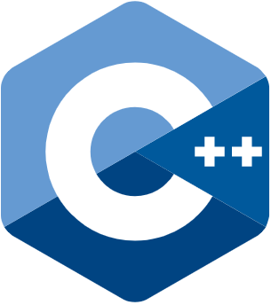
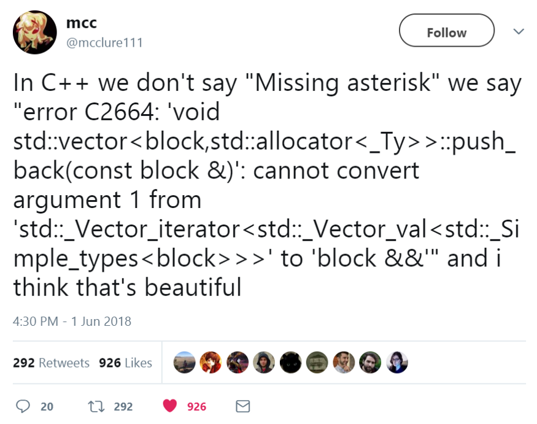
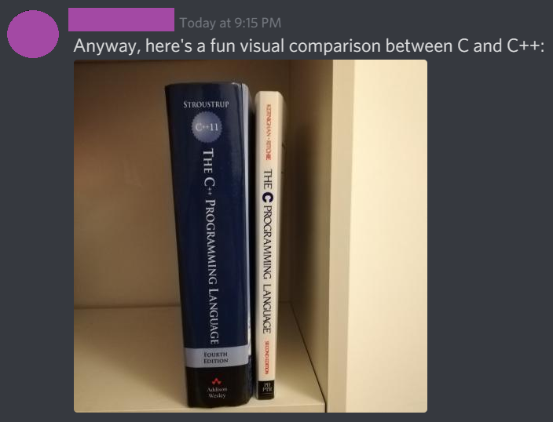
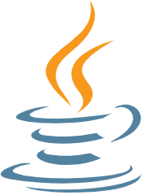
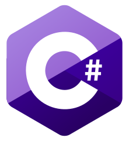
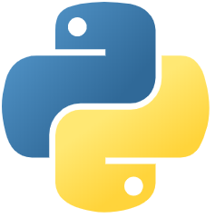
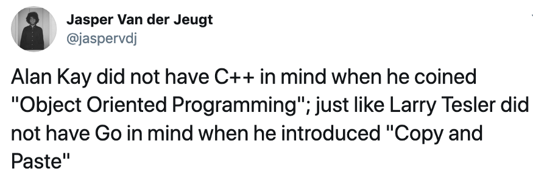

# 一文解决现代编程语言选择困难（第一部分：命令式编程）

---

**摘要：** 如果搜索“最佳编程语言”，结果会罗列一堆文章，涵盖各主流语言，并且大多对各语言优缺点的表述模棱两可，表述不到位，缺少实战借鉴意义。本文概述了当前再用的现代编程语言，按推荐程度从低到高依次列出。希望本文有助于选择合适的工具完成工作，降低开发工作量。原文篇幅过长。译文按设计用于命令式编程的C语言家族，以及设计用于响应式编程的ML语言家族，分为上下两篇提供。本文是上篇。

**作者：**  [Ilya Suzdalnitski](https://suzdalnitski.medium.com/)

**正文：**


如何了解某种编程语言的优缺点？某种编程语言是否适用于我的项目？面对此类问题，如果求助于搜索“最佳编程语言”，结果会罗列一堆文章，涵盖Python、Java、JavaScript、C#、C++、PHP等，并且大多对各语言的优缺点表述得模棱两可。我本人很不喜欢去读此类文章，因为其中许多部分内容的表述并不到位，缺少实战借鉴意义，而且行文生硬。再次我撰文做深入总结，去伪存真。

本文概述了当前广为使用乃至可能小众的现代编程语言，力图做到尽量客观、值得一读，并不带个人偏见。各语言按推荐程度从低到高依次列出。

谨记，并不存在所谓完美的编程语言。有的语言非常适用于后端/API开发，而有的语言则非常适用于系统编程。

文中按当今两大通用语言家族分类，即[C衍生语言家族](https://en.wikipedia.org/wiki/List_of_C-family_programming_languages)和[元语言（Meta Language，ML）衍生语言家族](https://en.wikipedia.org/wiki/ML_(programming_language))。

对于开发人员而言，编程语言只是工具箱中的工具，更重要的是如何选择合适的工具去完成工作。我衷心希望本文有助于读者选取适合自身项目的编程语言。做出正确的选择，可降低数月甚至数年的开发工作量。

**译者注**：原文篇幅过长。译文按设计用于命令式编程的C语言家族，以及设计用于响应式编程的ML语言家族，分为上下两篇提供。本文是上篇。

## 哪些编程语言特性值得关注？


很多编程语言排行榜文章，主要对比的是语言使用广泛度、开发人员收入期望值等因素。在软件领域，虽然大规模的社区和生态系统的确有所裨益，但语言的使用情况并非好的排行指标。本文另辟蹊径，采用的评判依据主要考虑语言的强大之处和不足之处。

为表示所列语言的推荐程度，文中使用“赞”（👍）、“否”（👎）和“尚可”（👌，即不赞也不否）三种emoji。

那么应该比较哪些特性？换句话说，除了语言使用广泛性，还有哪些特性更能代表语言的受欢迎程度？

### 类型系统（Type System）

类型系统倍受大量开发人员的青睐，这也是为什么TypeScript之类的语言日渐大行其道。在我看来，类型系统去除了大量的程序错误，更易于实现重构。但是否具有类型系统，只是本文考虑的部分评判因素。

支持类型系统的编程语言，最好同时具备类型推断（type inference）。一个好的类型系统，不用明确地标出函数签名（function signature），支持对大部分类型的推断。不幸的是，大多数编程语言提供的仅是基本的类型推断功能。

更进一步，支持代数数据类型（Algebraic Data Types，ADT）的类型系统评分更高。

强大的类型系统，还应支持高级类类型（higher-kinded types）。高级类类型是对泛型（generics）的更高阶抽象，支持编程人员在更高的抽象层上编程。

尽管大家对类型系统寄予厚望，但还有一些比静态类型（static typing）更重要的特性。因此在选择一门编程语言时，不能只看是否支持类型系统，


### 学习难度

即便编程语言是完美无瑕的，如果一位新手上船需要前期投入数月甚至是数年的精力，那么又会有多少人使用呢？另一方面，很多编程范式需要数年的时间才能逐渐完善。

好的编程语言需对新手友好，掌握不应花大量学习时间。

### 空值

> 我将1965年创建的空值引用（null reference）称为“亿万美元错误”。当时，我正设计首个完全类型系统，用于面向对象语言中的引用。目标是确保所有对引用的使用是绝对安全的，并由编译器自动执行检查。我无法克制添加空值引用的诱惑，完全因为空值引用非常易于实现。近四十年来，这一设计导致了不计其数的错误、漏洞和系统崩溃，可能造成了数十亿美元的痛心损失。

> — 空值引用的创立者Tony Hoare

为什么说空值引用是不好的？因为空值引用破坏了类型系统。一旦默认为空值，那么就不能依靠编译器检查代码的有效性。任何空值都是一枚随时可能引爆的炸弹。如果并未考虑所使用的值的确为空值，那么会产生什么后果？会出现运行时错误。

```
function capitalize(string) {
  return string.charAt(0).toUpperCase() + string.slice(1);
}

capitalize("john");  // -> "John"
capitalize(null);   // 未捕获类型错误：不能读取为空值的属性“charAt”。
```

为确保所处理的值并非空值，开发人员必须运行时做手工检查。即使是静态类型语言，空值引用也破坏了类型系统的很多优点。

```
function capitalize(string) {
  if (string == null) throw "string is required";
    
  return string.charAt(0).toUpperCase() + string.slice(1);
}
```

运行时检查也称为“空值防护”（null guards），在现实中可归为一种不良的编程语言设计。一方面，引入样板代码破坏了编程风格。更糟的是，并不能确保是否检查了空值。


好的编程语言，应在编译时做类型检查，判断值的存在与否。

因此，支持空值检查机制的编程语言应加分。

### 错误处理

捕获异常并不是一种好的错误处理方式。抛出异常本身没有问题，但仅适用于程序没有办法恢复而必须崩溃这类异常情况。异常和空值一样，会破坏类型系统。

如果将异常作为错误处理的首选方式，那么就无法获知函数是返回了期望值，还是发生了故障。抛出异常的函数也无法实现复合（Compose）。

```
function fetchAllComments(userId) {
  const user = fetchUser(userId); // 可能抛出异常。
  
  const posts = fetchPosts(user); // 可能抛出异常
  
  return posts    // posts可能为空值，这会再次导致异常。
          .map(post => post.comments)
          .flat();
}
```

无法获取部分数据而导致整个程序崩溃，这显然并非一种好的做法。尽管我们不希望发生此，但的确会发生。

一种做法是手工检查是否生成异常，但是在编程过程中可能会忘记对异常做检查，因此这种做法是非常不可靠的，而且会在代码中添加大量额外处理。


```
function fetchAllComments(userId) {
  try {
    const user = fetchUser(userId);

    const posts = fetchPosts(user);

    return posts
            .map(post => post.comments)
            .flat();
  } catch {
    return [];
  }
}
```

目前已有更好的错误处理机制，支持在编译时对潜在错误做类型检查。因此，默认无需采用异常处理的编程语言也应加分。


### 并发

当前正处于摩尔定律的末端，即处理器不会再大规模提速。我们身处多核CPU时代，所有的现代应用必须能很好地利用多核技术。

不幸的是，大多数当前在用的编程语言是设计用于单核计算时代的，本质上并不能有效地支持多核。

一种亡羊补牢的设计，是在后期提供支持并发的软件库。但这只是给语言打了补丁，并非从根本上就针对并发设计，不能称为良好的开发体验。一些现代语言内建了对并发的支持，例如Go、Erlang和Elixir等。


### 不可变性

> 我认为大型的面向对象程序，需要解决由于大规模可变对象间关联所导致的复杂图结构。否则在调用方法时，必须得把握并牢记该方法的功能和副作用。

> — [Rich Hickey](http://www.se-radio.net/2010/03/episode-158-rich-hickey-on-clojure/)，Clojure创建者。

当前编程中，使用不可变值越来越常见。即便是React这样的现代UI软件库，也考虑使用不可变值。对支持不可变数值提供一等支持的编程语言，我们将评判更高。完全是因为不可变性避免了编程中出现许多软件缺陷。


什么是不可变状态？简而言之，就是数据不会发生改变。例如，大多数编程语言中的字符串。字符串转为大写，并不会去改变原始的字符串，而是返回一个新的字符串。


为确保任何事情都不发生改变，不可变性对该理念做了进一步扩展。更改不可变数组，总是会返回一个新的数组，而非原始数组。更新用户名，将返回一个包含更新后用户名的新用户对象，并不改变原始对象。


不可变状态不做任何共享，因此无需操心线程安全所导致的复杂性。不可变性使得代码更易于并行化。

不对状态做任何更改的函数，称为“纯函数”（Pure）。纯函数更易于测试和推断。使用纯函数，无需操心函数体之外事情，可聚焦于函数本身。不用像面向对象编程中那样必须牢记整个对象图，这样极大地简化了编程开发。


### 生态系统和工具

一种编程语言可能本身并没有多少亮点，但如果其具有大型的生态系统，这会令语言更具吸引力。具备良好的软件库，可以节省数月乃至数年的开发工作。

显著的例子就是JavaScript和Python。


### 速度

语言的编译速度如何？程序的启动速度如何？运行时的性能如何？所有这些都是影响评判中的考虑因素。


### 存在年代

尽管并非绝对，通常新推出的语言要比原先的语言更好。只是因为新语言会吸取了前辈的经验教训。


## C++



下面从最糟糕、也可能是计算机科学中最大错误的C++语言开始。当然，我并不认为C++是一种很好的现代编程语言。但C++当前依然得到广泛应用，在此必须提及。


语言家族：C


👎 语言特性


> C++可称为糟糕透顶的语言。。。如果项目局限于C，意味着不会有任何机会被愚蠢的“对象模型”搞砸。

> — Linux创立者Linus Torvalds

C++中填充了各种特性，力图无所不能，但在在其中任何一项上都不能说出色。C++支持goto、指针、引用、面向对象编程、操作符重载，以及各种非生产特性。

为什么说C++不好？在我看来，最大问题在于C++颇具年头了。C++是在1979年设计的。在当时设计者缺少经验，关注点发散，虽然所添加的特性在当时看来是似乎好的做法。C++得到了非常广泛的使用，这意味着为其中支持各种用例而添加了更多特性，导致特性成堆。


👎 速度

C++的编译时间出奇的慢，甚至比Java慢很多，尽管与Scala不相上下。

但在运行时性能和启动时间上，C++程序表现非常优秀。


👎 生态系统和工具



上图的推文给出了很好的解释。C++编译器的错误信息对新手并不友好。通常并未指出导致错误的确切原因，需要开发人员花时间查找。


👎👎 垃圾回收

> 我曾希望在C++0x标准中至少考虑可选地支持垃圾回收，但这在技术上存在问题。

> — C++的创建者Bjarne Stroustrup
  
垃圾回收从未添加到C++中，而手工内存管理非常易于出错。开发人员必须操心如何手工释放和分配内存。我对使用非垃圾回收语言的经历记忆深刻，其中大量的缺陷在当前支持垃圾回收语言中可轻易避免。  

👎 面向对象编程的失败尝试

> 我提出了“面向对象”一词，但并没有没有顾及C++。
> 
> — 面向对象编程的创建者Alan Kay

面向对象编程是一项很好的技术，出现于上世纪六十年代后期，当时C++刚出现。不幸的是，不同于Smalltalk等语言，C++在实现面向对象编程中出现了几个致命错误，导致好的理念变成噩梦。 


好的一方面是，不同于Java，至少在C++中面向对象是可选的。


👎👎 学习难度



C++是一种复杂的低层（low level）语言，不具备任何自动内存管理。由于特性纷杂，初学者必须花费大量时间学习。


👎 并发

C++设计用于单核计算时代，只支持简单的并发机制，这还是在近十年中添加的。

👎 错误处理

抛出并捕获错误是C++的首选错误处理机制。


👎 不可变性

未内置对不可变数据结构的支持。

👎 空值

C++中所有引用均可为空值。


### 评判


C++的初衷是成为更好的C语言，但这一初衷并未实现。

系统编程是C++的最适合使用场景。但考虑到已具有Rust和Go等更好、更现代替代语言，系统完全可不用C++实现。不管读者同意与否，我不认为C++具有任何优点。

是该终结C++的时候了。

## Java




> Java是自MS-DOS以来计算机领域中最令人困扰的事情。

> - 面向对象编程创始人[Alan Kay](http://www.cc.gatech.edu/fac/mark.guzdial/squeak/oopsla.html)

 
Java出现在1995年，比C++晚了16年。Java是更简单的编程语言，由此得到广泛使用。

语言家族：C。

👍 垃圾回收

相比C++，Java的最大优点是具有垃圾回收，这极大地消除了各类软件缺陷。


👍 生态系统

Java已经存在很长时间，在后端开发领域形成了大型生态系统，极大地降低了开发工作。

👎 面向对象语言

本文不会深入探讨面向对象编程的不足。详细分析可阅读本文作者的另一篇文章，“[面向对象编程：亿万美元灾难](https://medium.com/better-programming/object-oriented-programming-the-trillion-dollar-disaster-92a4b666c7c7)”。

在此给出计算机科学中一些最为杰出人士的看法：

> 抱歉，我多年前使用了“对象”一词。该词使得很多人聚焦于一个更狭义的理念，虽然更广义的理念是消息传递。

> — 面向对象编程的创始人Alan Kay

Alan Kay是对的，许多主流面向对象编程语言并未找准关注点。它们聚焦于类和对象，而忽视了消息传递。幸运的是，Erlang和Elixir等一些现代编程语言找准了方向。


> 受面向对象编程影响的编程语言，会导致计算机软件冗长，可读性不好，描述性差，难修改和维护。

> — [Richard Mansfield](http://www.4js.com/files/documents/products/genero/WhitePaperHasOOPFailed.pdf)

所有使用Java、C#等面向对象编程语言的开发人员，如果曾具有使用非面向对象编程语言的经验，对此应深有体会。

👌 速度

大家都知道，Java运行在JVM之上，而JVM的启动速度是出名的慢。我曾看到有运行在JVM上的程序耗时30多秒才启动起来。对于现代云原生程序，这是不可接受的。

一个大型项目，如果编译速度慢，就会对开发人员的生产效率产生显著影响。Java、Scala等JVM语言存在同样的问题。

但从好的一面说，JVM Runtime的性能还算不错。


👎 学习难度

尽管Java是一种相当简单的语言，但Java以面向对象编程为主，这使得Java很难做到优秀。编写一个简单的Java程序可信手拈来，但是掌握如何编写可靠、可维护的面向对象代码，则需要十数年的Java功力。

👎 并发

Java设计于单核计算时代，和C++一样，仅支持基本的并发特性。

👎 空值

Java中，所有引用均可为空值。


👎 错误处理

抛出并捕获错误是Java的首选错误处理机制。


👎 不可变性

未内置对不可变数据结构的支持。


### 判定


Java在刚推出时，的确是一种很好的编程语言。但遗憾的是不同于Scala等语言，Java始终专注于面向对象编程。 Java编程严重受模板代码的影响，冗余代码多。

Java应该退居二线了。


## C#



C#和Java并没有本质上的差异。C#的早期版本，就是微软的Java实现。

C#具有Java的大部分优点。C#于2000年推出，比Java晚5年，借鉴了Java的经验教训。

语言家族：C

👌 语法

C#在语法上一直保持略微领先Java。尽管是一种面向对象语言，但C#在解决模板代码问题上比Java有所改进。很高兴看到C#每个新版本都能改进语法。例如，添加了表达体函数成员（expression-bodied function members）、模式匹配、元组等特性。


👎 面向对象语言

和Java一样，C#主要针对面向对象编程。面向对象编程的缺点如上所列，在此不再详述。下面列出一些知名人士的观点。

> 我认为相比函数式语言，面向对象语言中缺失可重用性。问题在于，面向对象语言需要处理其所提供的所有隐含（implicit）环境。尽管我们想要的只是一根香蕉，但却得到了一只握着香蕉的大猩猩，甚至是整个丛林。

> — Erlang的创建者Joe Armstrong

我完全同意这个说法，相比函数式编程，命令式编程非常难以重用面向对象代码。


> 面向对象编程提供了对正确做法的一个反面教材……

> — 计算机科学先驱Edsger W. Dijkstra

从我自己使用面向对象和非面向对象编程的经验看，我完全同意面向对象代码更难以正确实现功能。

👎 多范式（Multi-paradigm）

C#声称是一种多范式语言，尤其是声称支持函数式编程，但我并不同意。对函数提供一流支持（first-class functions），并不足以称之为函数式语言。

那么什么语言可称为具备函数式特性？应至少内置支持不可变数据结构、模式识别、组合函数的管道操作符、代数数据类型（ADT）等特性。


👎 并发

和Java一样，C#创立于单核计算时代，仅提供基本的并发支持。


👎 空值 Nulls

C#中，所有引用均可为空。


👎 错误处理

抛出并捕获错误是C#的首选错误处理机制。


👎 不可变性

未内置对不可变数据结构的支持。


### 评判

尽管我本人的职业生涯中主要使用的是C#，但还是对这种语言评价不高。与对Java的评判一样，我建议读者寻找更现代的替代语言。C#在本质上依然是Java，只是具有更现代的语法。

不幸的是，C#本身并不“sharp”。

## Python



Python早在1991年提出，和JavaScript并称当前使用最广的两种语言。

语言家族：C


👍 生态系统

Python软件库几乎无所不能。不同于JavaScript，Python不能用于Web前端开发，但大规模的数据科学软件库弥补了此上的不足。

👍 学习难度

Python语言非常简单，初学者数周就能上手。


👎 类型系统

Python是动态类型的，因此谈不上需要类型系统。


👎 速度

Python是一种解释性语言，性能慢。对性能有严格要求的程序，可使用Cython替代原生的Python。

相对于原生语言，Python的启动也相当慢。


👎 工具 

对比其他的现代编程语言，难免会对Python的依赖管理颇为失望。目前存在pip、pipenv、virtualenv、pip freeze等工具。相比之下，JavaScript只需要NPM这一种工具。

👎 并发

Python在创建时并未全面考虑并发，仅提供基本的并发。

👎 空值

Python中所有引用均可为空。


👎 错误处理

抛出并捕获错误是Python的首选错误处理机制。

👎 不可变性

未内置对不可变数据结构的支持。

### 评判


很不幸，Python并不提供对函数式编程的支持。函数式编程非常适合处理数据科学所面对的问题。即便是在Python擅长的Web爬虫领域，Elixir等函数式语言表现更好。

我并不推荐使用Python完成大型项目，该语言在构建中并未充分地考虑软件工程。

如果有更好的选择，不推荐在数据科学之外使用Python。在数据科学领域，Julia可能是Python的很好替代，尽管相比Python而言，Julia的生态系统近乎不存在。


## Rust


Rust是一种现代低层语言，最初设计用于替代C++。

语言家族：C

👍 速度

运行快速是Rust设计所秉持的初衷。在编译性能上，Rust程序要慢于Go程序，但运行时性能比Go稍快。

👍 空值

至此，本文推荐列表中终于出现支持现代空值的语言了。Rust中没有`null`或`nil`值，开发人员使用Option模式。

```
// 源代码: https://doc.rust-lang.org/rust-by-example/std/option.html

// 返回值或者是T类型的Some，或是None。
enum Option<T> {
    Some(T),
    None,
}

// 整数除法不会出错。
fn checked_division(dividend: i32, divisor: i32) -> Option<i32> {
    if divisor == 0 {
        // 错误表示为None。
        None
    } else {
        // 结果使用Some封装。
        Some(dividend / divisor)
    }
}

// 该函数用于处理失败的除操作。
fn try_division(dividend: i32, divisor: i32) {
    // 与其他枚举一样，Option值可模式匹配。
    match checked_division(dividend, divisor) {
        None => println!("{} / {} failed!", dividend, divisor),
        Some(quotient) => {
            println!("{} / {} = {}", dividend, divisor, quotient)
        },
    }
}
```

👍 错误处理

Rust的错误处理引入了现代函数式方法，使用特定的Result类型，声明可能会产生失败的操作。Result模式非常类似于Option模式，只是在None的情况下依然有值。

```
// 结果或者是T类型的OK函数值，或是E类型的Err函数值。
enum Result<T,E> {
    Ok(T),
    Err(E),
}

// 存在失败可能的函数。
fn random() -> Result<i32, String> {
    let mut generator = rand::thread_rng();
    let number = generator.gen_range(0, 1000);
    if number <= 500 {
        Ok(number)
    } else {
        Err(String::from(number.to_string() + " should be less than 500"))
    }
}

// 处理函数的结果。
match random() {
    Ok(i) => i.to_string(),
    Err(e) => e,
}
```

👎 内存管理

在本文列出的现代编程语言中，Rust是唯一不提供垃圾回收的。Rust迫使开发人员去考虑如何实现底层的内存管理，这影响了开发人员的效率。

👎 并发

由于Rust中缺少垃圾回收，因此实现并发是相当困难的。开发人员必须考虑“装箱”（boxing）和“钉住”（Pinning）。这在具有垃圾回收机制的语言中，通常是自动完成的。


👎 不可变性

未内置对不可变数据结构的支持。

👎 低层语言

作为一种低层语言，开发人员的生产效率无法其他高层语言相比。同时，语言的学习难度明显增大。

### 评判


Rust非常适合系统编程。尽管比Go更复杂，但Rust提供了强大的类型系统。Rust提供了现代的空值替换和错误处理方法。

为什么本文将Rust排在TypeScript和JavaScript之后？Rust是一种设计用于系统编程的低层语言，并非后端和Web API开发的最适合选项。Rust缺少垃圾回收机制，未内置对不可变数据结构的支持。


## TypeScript


TypeScript语言编译为JavaScript，通过对JavaScript添加静态类型，意在成为一种“更好的JavaScript”。类似于JavaScript，TypeScript同样用于前端和后端开发。


TypeScript由同是C#设计者的Anders Hejlsberg设计的，因此代码看上去非常类似C#，可认为是一种用于浏览器的C#。

语言家族：C。


👎 JavaScript的超集 

定位JavaScript的超集，有助于人们采用TypeScript。毕竟大多数人对JavaScript耳熟能详。

但作为JavaScript的超集，更多则是缺点。这意味着TypeScript继承了JavaScript的全部问题，局限于JavaScript所有的不良设计决策。

例如，应该没有开发人员喜欢`this`关键词吧。但TypeScript依然刻意原封照搬。

再有，其类型系统时常令人感到奇怪。

```
[] == ![];    // -> 为真
NaN === NaN;  // -> 为假！
```

换句话说，TypeScript具有JavaScript的所有缺点。做为超集，同样保留了缺点。

👍 生态系统

TypeScript完全分享了JavaScript庞大的生态系统。这是其最大优点。特别是相比Python等语言，NPM非常好用。

缺点在于，并非所有的JavaScript软件库都可在TypeScript中使用，例如Rambda/Immutable.js等。

👌 类型系统

个人感觉，TypeScript的类型系统毫无亮点。

好的一面是甚至提供对ADT的支持。例如下面给出的差别联合（discriminated union）类型,


```
// 源代码来自https://stackoverflow.com/questions/33915459/algebraic-data-types-in-typescript

interface Square {
    kind: "square";
    size: number;
}

interface Rectangle {
    kind: "rectangle";
    width: number;
    height: number;
}

interface Circle {
    kind: "circle";
    radius: number;
}

type Shape = Square | Rectangle | Circle;

function area(s: Shape) {
    switch (s.kind) {
        case "square": return s.size * s.size;
        case "rectangle": return s.height * s.width;
        case "circle": return Math.PI * s.radius ** 2;
    }
}
```

下面是使用ReasonML实现的同样代码：


```
type shape = 
   | Square(int)
   | Rectangle(int, int)
   | Circle(int);

let area = fun
   | Square(size) => size * size
   | Rectangle(width, height) => width * height
   | Circle(radius) => 2 * pi * radius;
```

差别联合类型是在TypeScript 2.0中增添的，TypeScript的语法尚未企及函数式语言的高度。例如，在`switch`中的字符串匹配易于出错，编译器无法在大小写错误时给出警告。

TypeScript仅提供基本的类型推断。此外在使用TypeScript时，`any`关键字的出现频次难免过高。

👌 空值

TypeScript 2.0添加了对不可为空（non-nullable）类型的支持，使用编译器选项`--strictNullChecks`启用。但使用不可为空类型并非编程默认，也并非TypeScript的惯用做法。

👎 错误处理

TypeScript中，使用抛出和捕获异常处理错误。


👎 新的JavaScript特性

新酷特性首先在JavaScript中支持，然后才是TypeScript。实验特性可使用Babel在JavaScript中得到支持，而在TypeScript中则无此功能。


👎 不可变性

TypeScript对不可变数据结构的处理，要显著劣于JavaScript。JavaScript开发人员可使用支持不可变性处理的软件库，但TypeScript开发人员通常必须依赖原始数组或对象展开操作符（spread operator），即写入时复制（copy-on-write）。

```
const oldArray = [1, 2];
const newArray = [...oldArray, 3];


const oldPerson = {
   name: {
     first: "John",
     last: "Snow"
   },
   age: 30
};

// 执行对象深拷贝（deep copy）非常繁琐。
const newPerson = {
  ...oldPerson,
  name: {
     ...oldPerson.name,
     first: "Jon"
  }
};
```

正如上面代码所示，原生扩展操作符并不支持深拷贝（deep copy），而手工扩展深度对象非常繁琐。大型数组和对象的拷贝的性能也非常不好。

但TypeScript中，`readonly`关键字非常好用，用于定义属性是不可变的。虽然如此，TypeScript要对不可变数据结构提供很好支持，依然需要很多工作。

JavaScript提供了一些操作不可变数据的很好软件库，例如Rambda/Immutable.js。但是，实现此类软件库对TypeScript的支持并非易事。


👎 TypeScript对比React

> 相比[Clojure](https://clojure.org/)等从设计上考虑到不可变数据处理的语言，在JavaScript和TypeScript中不可变数据的处理相对更为困难。

> —— 原文引用自[React官方文档](https://reactjs.org/docs/update.html)

继续说缺点。前端Web开发推荐使用React。  

React并未针对TypeScript设计。最初，React是针对函数式语言设计的，本文稍后会详细介绍。二者在编程范式上存在冲突，TypeScript是面向对象编程优先的，而React是函数优先的。

React中，函数参数props是不可变的；而TypeScript中，没有内置提供适用的不可变数据结构支持。

在开发中，TypeScript相比JavaScript、React的唯一优点是，无需操心PropTypes。

### TypeScript是否是JavaScript的超集?

这取决于开发人员的认识。至少我认为是的。做为超集的最大优点，是可访问整个JavaScript生态系统。

为什么JavaScript的超集语言备受关注？这与Java、C#广为采用是同样的原因，是因为背后有市场营销预算充足的大厂在提供支持。


### 评判


尽管TypeScript常被认为是“更好的JavaScript”，但我依然评判其劣于JavaScript。TypeScript相比JavaScript的优点被夸大了，尤其是对于使用React做前端Web开发。


TypeScript保留了JavaScript的所有不足，实际上也继承了JavaScript中数十年积累不良设计决策，的确并非一种成功的交付，


## Go


Go设计上主要考虑了提高多核处理器和大规模代码库的编程效率。Go的设计者们当时任职于谷歌，因对C++的共同不喜而得到灵感。

语言家族：C。


👍 并发

并发是Go的杀手级特性。Go从本质上就是为并发而构建。和Erlang/Elixir一样，Go使用邮箱模型（Mailbox）实现并发。不幸的是，goroutines并未提供Erlang/Elixir进程那样的统一容错特性。换句话说，goroutine中的异常将导致整个程序宕机，而Elixir进程中的异常只会导致当前进程终止。


👍 👍 速度 

编译速度是谷歌创建Go的一个重要考虑。有个笑话，谷歌利用C++编译代码的时间就创建出了Go。


Go是一种高效的语言。Go程序的启动时间非常快。Go编译为原生代码，所以运行时速度也非常快。


👍 学习难度

Go是一种简单的语言，如果得到有经验前辈的指导，新手能在一个月内掌握。

👍 错误处理

Go并不支持异常，由开发人员显式处理各种可能的错误。和Rust类似，Go也返回两个值，一个是调用的结果，另一个是可能的错误值。如果一切运行正常，返回的错误值是nil。


👍 不支持面向对象编程

虽然这么说有人会反对，但我个人认为，不支持面向对象特性是很大的优势。

重申Linux Torvalds的观点：

> C++是一种很糟的（面向对象）语言… 将项目局限于C，意味着整个项目不会因为任何愚蠢的“对象模型”而搞砸。

> — Linux创建者Linus Torvalds

Linus Torvalds公开对C++和面向对象编程持批评态度。限制编程人员在可选的范围内，是他完全正确的一面。事实上，编程人员的选择越少，代码也会更稳定。

在我看来，Go可以回避了许多面向对象特性，免于重蹈C++的覆辙。


👌 生态系统

> 一些标准库的确很笨重。大部分并不符合Go返回带外（out-of-band，OOB）错误的自身哲学。例如，有的库对索引返回-1值，而非(`int`, `error`)。还有一些库依赖全局状态，例如`flag`和`net/http`。

Go的软件库缺少标准化。例如在错误时，有的库返回(int, error)，也有软件库返回-1等值。还有一些库依赖标识等全局状态。

Go的生态系统规模远比不上JavaScript。

👎 类型系统



几乎所有的现代编程语言都具有某种形式的泛型，其中包括C#和Java，甚至是C++也提供模板类。泛型支持开发人员重用不同类型的函数实现。如果不支持泛型，那么开发人员就必须对整型、双精度和浮点型单独实现加法函数，这将导致大量的代码冗余。换句话说，[Go缺失对泛型的支持](https://www.reddit.com/r/ProgrammerHumor/comments/eho336/larry_tesler_did_not_have_go_in_mind_when_he/)导致了大量冗余的代码。正如有人指出的，“Go”是“去写一些模板代码”（Go write some boilerplate）的缩写。

👎 空值

不幸的是，即使更安全的空值替代方案已存在数十年，Go依然在语言中添加了空值。

👎 不可变性

未内置对不可变数据结构的支持。

### 评判


> Go并非一种好的语言，但也谈不上不好，只是不够优秀。使用一种并不优秀的语言时需谨慎，因为这可能会导致我们在随后的二十年中陷入困境。

> - Will Yager的博客文章“[Why Go Is No Good](http://yager.io/programming/go.html)”

如果你并非供职于谷歌，也没有面对类似谷歌的用例，那么Go可能并非好的选择。Go是一种最适合系统编程的简单语言，但并非API开发的好选择。原因是因为我们有更多更好的替代语言，本文稍后介绍。

我认为总体而言，尽管G的类型系统略弱，但比Rust还是略好。Go是一种简单的语言，非常快，易于学习，并且具有出色的并发功能。当然，Go成功地实现了做为“更好的C++”这一设计目标。


### 最佳系统编程语言奖


最佳系统语言奖授予Go。实至名归，Go是系统编程的理想选择。Go是一种低层语言，使用Go构建的大量成功项目，例如Kubernetes，Docker和Terraform，证明其非常适合系统编程。

## JavaScript


作为当前最流行的编程语言，JavaScript无需过多介绍。

当然，将JavaScript排在Rust、TypeScript和Go之前是正确的。下面给出原因。

语言家族：C


👍 👍 生态系统

生态系统是JavaScript的最大优势。我们能想到的所有，，包括Web的前端和后端开发，CLI编程、数据科学，甚至是机器学习，都可使用JavaScript。JavaScript可能具有提供任何功能的软件库。

👍 学习难度

JavaScript和Python都是非常容易学习的编程语言。几周就能上手做项目。

👎 类型系统

和Python类似，JavaScript是动态类型的。无需过多解释，但是其类型系统时常看起来很奇怪：

```
[] == ![] // -> 为真
NaN === NaN; // -> 为假
[] == ''   // -> 为真
[] == 0    // -> 为真
```

👌 不可变性

在TypeScript一节中已经介绍，展开操作符（spread operator）会影响性能，甚至并没有在拷贝对象时执行深拷贝。尽管有Ramda/Immutable.js等软件库，但JavaScript缺少对不可变数据结构的内建支持。

👎 JavaScript并非针对响应式设计的

在JavaScript中使用React，必须借助PropTypes。但这也意味着必须去维护PropTypes，这会导致灾难性后果。

此外，如果在编程中不加注意的话，可能会导致严重的性能问题。例如：


```
<HugeList options=[] />
```

这个看上去无害的代码会导致严重性能问题。因为在JavaScript中， `[] != []`。上面的代码会导致`HugeList`在每一次更新时重渲染，尽管`options`值并未发生变化。此类问题会不断叠加，直到用户界面最终无法响应。

👎 关键字`this`

关键字`this`应该是JavaScript中的最大反特性。其行为持续表现不一致，在不同的情况下可能意味完全不同，其行为甚至取决于谁调用了指定的函数。使用`this`关键字通常会导致一些细微而奇怪的错误，难以调试。


👌 并发

JavaScript使用事件循环支持单线程并发，无需考虑加锁等线程同步机制。尽管JavaScript在构建时并未考虑并发性，但与大多数其他语言相比，更易于实现并发代码。

👍 新的JavaScript特性

相比TypeScript，新特性能更快地在JavaScript中支持。即便是实验性特性，也可使用Bable支持在JavaScript中使用。


👎 错误处理 Error handling

抛出并捕获错误是JavaScript的首选错误处理机制。

### 评判


JavaScript并非一种很好设计的语言。JavaScript的最初版本仅用十天就拼凑出来，尽管在后期版本中修正了许多缺点。

抛开上述缺点，JavaScript依然是全栈Web开发和很好选择。如果加以[适当的代码修炼](https://medium.com/better-programming/js-reliable-fdea261012ee)和分析，JavaScript是一种很好的语言。


**原文链接：** [These Modern Programming Languages Will Make You Suffer](https://medium.com/better-programming/modern-languages-suck-ad21cbc8a57c)